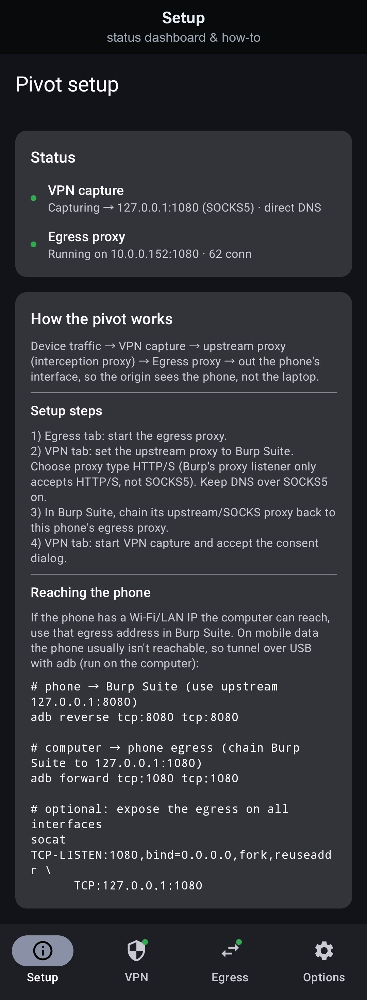
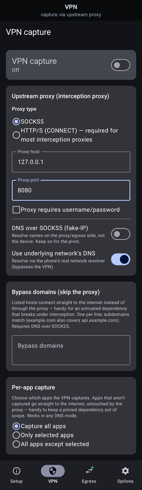
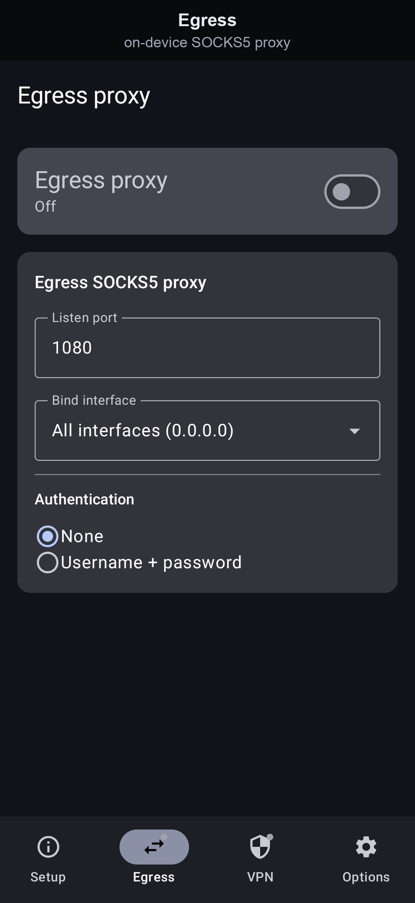

<div align="center">
  

# Pivot Proxy

</div>

An Android app for penetration testing that turns the phone into a transparent
**pivot**: it captures all device traffic through a local VPN, routes it through an
external inspection proxy (e.g. **Burp Suite**), and sends it back into the phone's
own SOCKS5 proxy so it finally egresses through the phone's own network interface.

The result: you can inspect 100% of a device's traffic in Burp while the origin
servers still see the **phone's** IP (same carrier/Wi-Fi network), and DNS names are
resolved on the phone, not on the laptop running Burp.

```
apps on phone ─▶ VPN capture ─▶ upstream proxy (Burp) ─▶ phone's egress proxy ─▶ internet
                                                            (resolves DNS on-device,
                                                             egresses via phone)
```

The app is pure Kotlin + Jetpack Compose with **no custom native binaries** — the
tun↔SOCKS bridge is a userspace TCP/IP stack written in Kotlin. It uses code from
[SocksDroid](https://github.com/bndeff/socksdroid) and
[MicroSocks](https://github.com/rofl0r/microsocks), translated into Kotlin.

> Security note: this is a tool for **authorized** testing of devices and networks
> you own or are permitted to test. A VPN that captures all traffic and routes it
> through a proxy is powerful — use it responsibly.

---

## Features

### Screenshots

<p align="center">
  <a href="docs/screenshots/raw/setup.jpg"></a>
  &nbsp;&nbsp;&nbsp;
  <a href="docs/screenshots/raw/vpn.jpg"></a>
  &nbsp;&nbsp;&nbsp;
  <a href="docs/screenshots/raw/egress.jpg"></a>
</p>

### Two engines

- **Egress proxy** — an on-device SOCKS5 server that finally egresses captured traffic
  through the phone's own network interface, so origin servers see the **phone's** IP
  and DNS is resolved on-device. Configurable port, bind address and auth.
- **Capturing VPN** — a local `VpnService` that pulls all device traffic through a
  userspace, pure-Kotlin tun↔SOCKS bridge and forwards it to your upstream inspection
  proxy (Burp Suite), with DNS-over-SOCKS5.

Running both at once **is** the pivot.

### Drive it from four tabs

| Tab | What it's for |
| --- | --- |
| **Setup** | A live status dashboard (Egress + VPN) and the pivot how-to. |
| **Egress** | The on-device SOCKS5 proxy that finally egresses traffic. Master switch + port/bind/auth. |
| **VPN** | The capturing VPN: the upstream proxy (Burp Suite), proxy type, DNS mode, domain bypass, and per-app capture. Master switch. |
| **Options** | Start the egress proxy and/or VPN capture on boot, and a shortcut to battery-optimization settings. |

The Egress and VPN nav icons carry a small status dot: **green = running**,
**grey = stopped**.

### Scope what gets intercepted
- **Bypass domains** — hosts that connect straight to the internet, skipping the proxy
  (subdomains match). Handy for a pinned dependency that breaks under interception.
- **Per-app capture** — capture all apps, only selected apps (just your target), or
  all-except-selected. Excluded apps never enter the VPN, so their traffic and TLS are
  untouched.

### Automate from a PC
- **adb control** — both engines can be configured and toggled from an attached PC via
  `adb` broadcasts, handy for scripting an engagement. The control receiver is gated by
  `android.permission.DUMP`, so only adb/`shell` (and the system) can drive it. See
  **[docs/adb-control.md](docs/adb-control.md)** for the full action list and keys.

---

## Permissions & notes
- **Notifications** — both engines run as foreground services with an ongoing
  notification (Android requires this). Denying it just hides the notification; the
  proxy/VPN still works.
- **VPN consent** — Android shows a system dialog the first time you start VPN capture.
  This is mandatory for any VPN app, and it can't be shown from a broadcast — so start
  the VPN once from the app before driving it over adb.
- **Battery optimization** (optional) — some vendors kill background services; the
  Options tab links you to the exclusion setting if a service keeps stopping.

## Install
Grab the latest **`pivot-release.apk`** from the
[Releases page](https://github.com/dmatscheko/pivot-proxy-android/releases/latest)
and install it by opening the file on the device ("Install unknown apps"), or via adb:

```bash
adb install -r pivot-release.apk
```

Prefer to build it yourself? A debug build can be built and installed in one step:

```sh
./gradlew installDebug
```

To install with adb instead, build the APK first, then install it:

```bash
./gradlew assembleDebug
adb install -r app/build/outputs/apk/debug/pivot-debug.apk
```

See [DEVELOPMENT.md](DEVELOPMENT.md) for the toolchain and architecture.

This app is **sideloaded** — it is not on the Play Store.

## Setting up the pivot
The short version: start the **Egress** proxy, point the **VPN**'s upstream at your
Burp proxy, chain Burp back at the phone's egress, then start **VPN capture** —
traffic then flows apps → VPN → Burp → phone's egress → internet.

The full walkthrough — trusting Burp's CA for HTTPS, scoping which apps and domains
get captured, and reaching the phone over Wi-Fi or USB — is in
**[docs/pivot-setup.md](docs/pivot-setup.md)**.

---

## License

Copyright (C) 2026 David Matscheko

This program is free software: you can redistribute it and/or modify it under the
terms of the **GNU Affero General Public License** as published by the Free Software
Foundation, either version 3 of the License, or (at your option) any later version.

This program is distributed in the hope that it will be useful, but WITHOUT ANY
WARRANTY; without even the implied warranty of MERCHANTABILITY or FITNESS FOR A
PARTICULAR PURPOSE. See the GNU Affero General Public License for more details.

You should have received a copy of the GNU Affero General Public License along with
this program. If not, see <https://www.gnu.org/licenses/>. The full text is in
[LICENSE](LICENSE).
