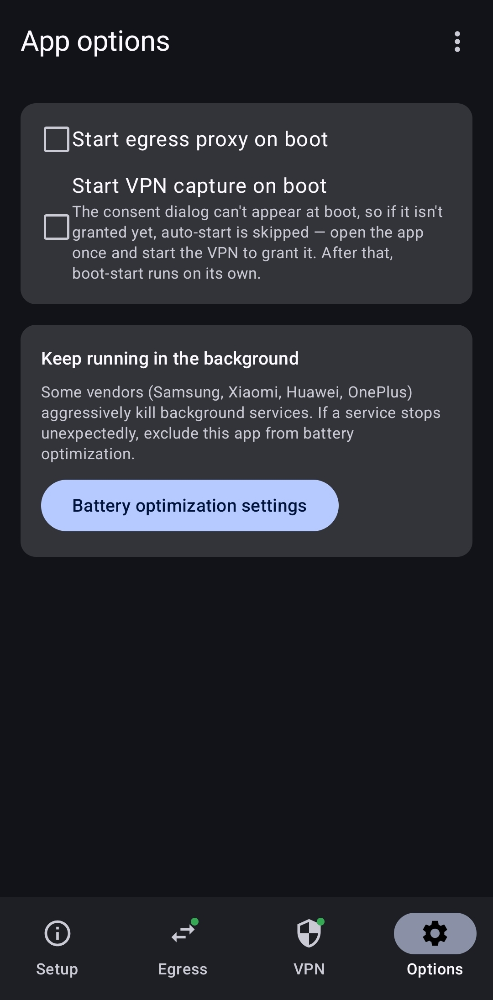

<div align="center">
  

# Pivot Proxy

</div>

An Android app for penetration testing that turns the phone into a transparent
**pivot**: it captures all device traffic through a local VPN, routes it through an
external inspection proxy (e.g. **Burp Suite**), and sends it back into the phone's
own SOCKS5 proxy so it finally egresses through the phone's own network interface.

The result: you can inspect 100% of a device's traffic in Burp while the origin
servers still see the **phone's** IP (same carrier/Wi-Fi network), and DNS names are
resolved on the phone, not on the laptop running Burp.

```
apps on phone ─▶ VPN capture ─▶ upstream proxy (Burp) ─▶ phone's egress proxy ─▶ internet
                                                            (resolves DNS on-device,
                                                             egresses via phone)
```

The app is pure Kotlin + Jetpack Compose with **no custom native binaries** — the
tun↔SOCKS bridge is a userspace TCP/IP stack written in Kotlin.

The app uses code from [SocksDroid](https://github.com/bndeff/socksdroid) and [MicroSocks](https://github.com/rofl0r/microsocks), but translated into Kotlin.

> Security note: this is a tool for **authorized** testing of devices and networks
> you own or are permitted to test. A VPN that captures all traffic and routes it
> through a proxy is powerful — use it responsibly.

---

## Requirements

- **JDK 17** (newer JDKs are not yet supported by the build toolchain — see below).
- The **Android SDK** with platform **API 35** installed.
- A device or emulator running **Android 7.0 (API 24)** or newer.

The easiest way to get all of this is to install **Android Studio**, which bundles a
compatible JDK 17 and can install the SDK for you. You can then build either from the
IDE (Run ▶) or from the command line as shown below.

---

## Build

### 1. Point the build at your Android SDK

Create a file named `local.properties` in the project root:

```properties
sdk.dir=/absolute/path/to/Android/sdk
```

(On macOS this is usually `/Users/<you>/Library/Android/sdk`; on Linux
`/home/<you>/Android/Sdk`; on Windows `C:\\Users\\<you>\\AppData\\Local\\Android\\Sdk`.)
Android Studio writes this file for you automatically when you open the project.

### 2. Make sure the build uses JDK 17

The build toolchain (Android Gradle Plugin 8.7) requires **JDK 17**. If your system
default `java` is newer (e.g. JDK 21/24), point the build at a JDK 17 explicitly.
Android Studio ships one you can reuse:

```bash
# macOS (Android Studio's bundled JDK):
export JAVA_HOME="/Applications/Android Studio.app/Contents/jbr/Contents/Home"
# Linux:
export JAVA_HOME="/opt/android-studio/jbr"
# Windows (PowerShell):
$env:JAVA_HOME="C:\Program Files\Android\Android Studio\jbr"
```

### 3. Build the APK

```bash
# Debug build (recommended for sideloading):
./gradlew assembleDebug

# Release build (unsigned-by-default; falls back to the debug key if no keystore):
./gradlew assembleRelease
```

The APK is written to:

- Debug:   `app/build/outputs/apk/debug/app-debug.apk`
- Release: `app/build/outputs/apk/release/app-release.apk`

> A release build is signed with your own keystore if you provide one (see
> [DEVELOPMENT.md](DEVELOPMENT.md)); otherwise it falls back to the debug key so the
> APK is still installable for personal/sideload use.

---

## Install

### With adb (recommended)

```bash
adb install -r app/build/outputs/apk/debug/app-debug.apk
```

### Directly on the device

Copy the APK to the device and open it. You may need to allow installing apps from
your file manager / browser ("Install unknown apps") the first time.

This app is **sideloaded** — it is not on the Play Store.

---

## First run & usage

The app has four tabs along the bottom:

| Tab | What it's for |
| --- | --- |
| **Setup** | A live status dashboard (Egress + VPN) and the pivot how-to. |
| **Egress** | The on-device SOCKS5 proxy that finally egresses traffic. Master switch + port/bind/auth. |
| **VPN** | The capturing VPN: the upstream proxy (Burp Suite), proxy type, DNS mode, domain bypass, and per-app capture. Master switch. |
| **Options** | Start-the-egress-proxy-on-boot, and a shortcut to battery-optimization settings. |

The Egress and VPN nav icons carry a small status dot: **green = running**,
**grey = stopped**.

### Screenshots

| Setup | Egress | VPN | Options |
| --- | --- | --- | --- |
| <a href="docs/screenshots/setup.jpg"></a> | <a href="docs/screenshots/egress.jpg"></a> | <a href="docs/screenshots/vpn.jpg"></a> | <a href="docs/screenshots/options.jpg"></a> |

### Setting up the pivot

1. **Egress tab** → start the **Egress proxy** (default port `1080`).
2. **VPN tab** → set the **Upstream proxy** to your Burp Suite proxy and choose the
   **Proxy type**: pick **HTTP/S** for Burp Suite (its proxy listener only accepts
   HTTP/S, not SOCKS5), or **SOCKS5** for a SOCKS5 upstream. Keep **DNS over SOCKS5**
   on.
3. In **Burp**, configure its upstream proxy / SOCKS chaining to point back at the
   phone's **egress** proxy (see *Reaching the phone* below for the address to use).
4. **VPN tab** → start **VPN capture** and accept the Android VPN consent dialog.

All device traffic now flows: apps → VPN → Burp → phone's egress proxy → internet,
with DNS resolved on the egress (phone) side.

> You don't have to use Burp. The "upstream proxy" can be any SOCKS5 or HTTP/S
> `CONNECT` proxy. Pointing the VPN's upstream (SOCKS5) directly at the local egress
> proxy gives a pure on-device pivot with no laptop involved.

### Trusting Burp's CA (HTTPS interception)

Burp does TLS man-in-the-middle: it presents its own CA certificate, so HTTPS apps on
the phone fail with a certificate error until the phone trusts that CA. Export it from
Burp as **Proxy → Proxy settings → Import / Export CA certificate → "Certificate in
DER format"** (save it as e.g. `cacert.der`) — the public **certificate only**, *not*
the P12.

Convert that DER to PEM for `curl` and for the hash step below (the Settings installer
accepts the DER as-is, so this is only needed for the other methods):

```bash
openssl x509 -inform DER -in cacert.der -out burp.pem
```

There is no single no-root switch that makes *every* app trust it; pick by target:

- **System store (root) — trusts all apps.** Install the cert into
  `/system/etc/security/cacerts/` named by its subject hash. Requires root (or a Magisk
  "trust user certs" module).

  ```bash
  # name the cert "<subject_hash>.0", then push it (needs a writable /system)
  HASH=$(openssl x509 -inform PEM -subject_hash_old -in burp.pem | head -1)
  cp burp.pem "$HASH.0"
  adb root && adb remount
  adb push "$HASH.0" /system/etc/security/cacerts/
  adb shell chmod 644 "/system/etc/security/cacerts/$HASH.0"
  adb reboot
  ```

- **User cert (no root) — older / opted-in apps only.** *Settings → Security →
  Encryption & credentials → Install a certificate → CA certificate*, then pick the DER
  file (give it a `.cer`/`.crt` extension). Trusted by the OS, browsers, WebViews, apps
  targeting **Android 6 (API 23) or older**, and any app that opts into user certs.
  Apps targeting API 24+ ignore the user store by default.

- **`network-security-config` (no root) — for an in-scope app you can rebuild.** Have
  the app trust user certs by adding a network-security-config, then install the user
  cert as above:

  ```xml
  <network-security-config>
    <base-config><trust-anchors>
      <certificates src="system"/>
      <certificates src="user"/>
    </trust-anchors></base-config>
  </network-security-config>
  ```

  If you can't rebuild it from source, repackage the APK with a tool like `apk-mitm`
  (adds user-cert trust and strips common pinning) — only for apps you're authorized to
  modify under the engagement scope.

> Quick check without installing anything: command-line `curl` reads the *system* CA
> bundle (not the user store), so point it at the cert directly —
> `curl --cacert burp.pem https://example.com`.

### Scoping what gets intercepted

Two controls on the **VPN** tab let you keep things out of scope (e.g. a pinned
dependency that breaks under interception, or apps you simply shouldn't touch):

- **Bypass domains** — a list of hosts that connect **straight to the internet**,
  skipping the proxy entirely. Subdomains match (`example.com` also covers
  `api.example.com`); one per line. Works in both DNS modes.
- **Per-app capture** — choose **Capture all apps**, **Only selected apps**
  (capture just your target), or **All apps except selected** (let a dependency
  bypass the VPN). Tap **Select apps** to pick them. Excluded apps never enter the
  VPN, so their traffic and TLS are untouched — useful when an app pins its
  certificate and can't trust Burp's CA.

> A handy pentest setup: **Only selected apps → your target app**, so Burp sees
> just that app's traffic and nothing else on the device.

### Reaching the phone

The two connections between the phone and the computer (Burp Suite) need a network path:

- **Phone on Wi-Fi/LAN** that the computer can reach: just use the phone's IP. The VPN
  upstream is `Burp-IP:8080`, and Burp's chain points at `phone-IP:1080` (the address
  shown on the Egress tab).

- **Phone on mobile data** (or otherwise not reachable): the phone's external IP is its
  carrier (often CGNAT) address and is **not reachable** from the computer. Tunnel both
  directions over USB with `adb` (run these on the computer):

  ```bash
  # phone → Burp: the phone reaches Burp via its own localhost:8080
  #   → set the app's VPN upstream proxy to 127.0.0.1:8080 (the default)
  adb reverse tcp:8080 tcp:8080

  # computer → phone egress: the computer reaches the egress via its localhost:1080
  #   → set Burp's upstream/SOCKS chain to 127.0.0.1:1080
  adb forward tcp:1080 tcp:1080
  ```

  `adb forward` binds only to the computer's `localhost`. To make the egress proxy
  reachable from other machines (or tools that won't use loopback), re-expose it on all
  interfaces with `socat`:

  ```bash
  socat TCP-LISTEN:1080,bind=0.0.0.0,fork,reuseaddr TCP:127.0.0.1:1080
  ```

> With `adb reverse`/`forward` the app's defaults already line up: VPN upstream
> `127.0.0.1:8080` and egress `:1080`.

### Permissions

- **Notifications** — both engines run as foreground services with an ongoing
  notification (Android requires this). The proxy/VPN still works if you deny it; the
  notification is just hidden.
- **VPN consent** — Android shows a system dialog the first time you start VPN
  capture. This is mandatory for any VPN app.
- **Battery optimization** (optional) — some vendors kill background services; the
  Options tab links you to the exclusion setting if a service keeps stopping.

---

## Troubleshooting

- **Build fails with a Java/JDK version error** — you're not on JDK 17. Set
  `JAVA_HOME` to a JDK 17 (step 2 above).
- **`SDK location not found`** — create `local.properties` (step 1) or open the
  project once in Android Studio.
- **VPN starts but nothing loads** — check the upstream proxy host/port, and that the
  proxy (Burp) is reachable from the phone and chained back to the egress address.
- **A service stops on its own after a while** — exclude the app from battery
  optimization (Options tab).

---

## Building from source / contributing

For the toolchain details, project layout, tests, on-device test recipes, and the
pure-Kotlin TUN stack that replaced the last native library, see
**[DEVELOPMENT.md](DEVELOPMENT.md)**.

---

## License

Copyright (C) 2026 David Matscheko

This program is free software: you can redistribute it and/or modify it under the
terms of the **GNU Affero General Public License** as published by the Free Software
Foundation, either version 3 of the License, or (at your option) any later version.

This program is distributed in the hope that it will be useful, but WITHOUT ANY
WARRANTY; without even the implied warranty of MERCHANTABILITY or FITNESS FOR A
PARTICULAR PURPOSE. See the GNU Affero General Public License for more details.

You should have received a copy of the GNU Affero General Public License along with
this program. If not, see <https://www.gnu.org/licenses/>. The full text is in
[LICENSE](LICENSE).
